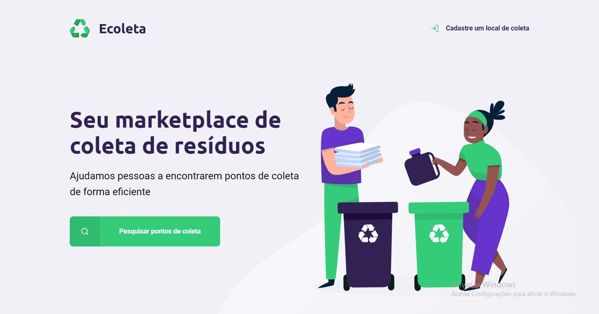
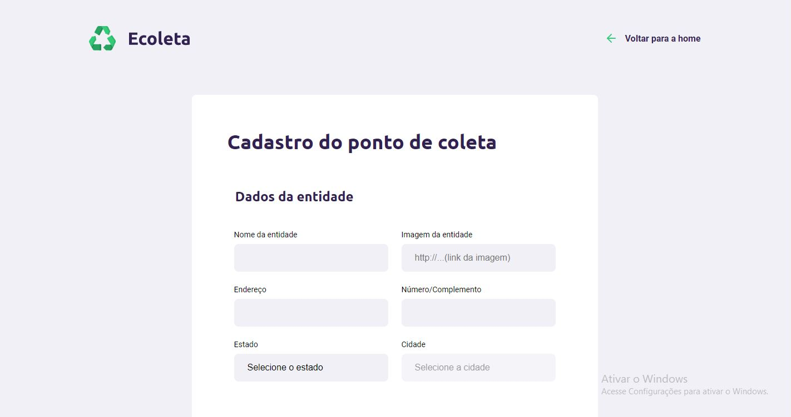
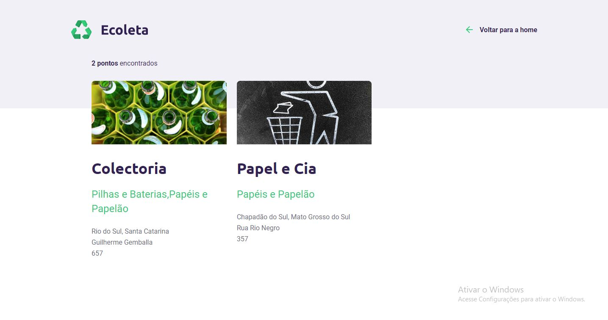

# nextLevelWeek-Ecoleta

Projeto para estudo de desenvolvimento web, através do curso da Rocket Seat: Next Level Week. 

Acesse a aplicação aqui: https://nlw--ecoleta.herokuapp.com/

A ideia do projeto é criar uma a plataforma para empresas de coleta seletiva cadastrarem seus endereços para que as pessoas possam encontrá-las e assim fazer um descarte correto de resíduos orgâncicos e materiais recicláveis.

Ferramentas utilizadas:
VSCode,
JavaScript / Node.js,
HTML,
CSS,
Nunjucks,
Git / GitHub,
Heroku,
SQlite3.

HOME

Aqui é possível cadastrar um endereço para um novo ponto de coleta, e também pesquisar os pontos previamente cadastrados.

CADASTRO

Para adicionar um novo ponto de coleta, basta inserir os dados requisitados, e selecionar quais itens de coleta sua empresa é responsável por recolher, assim o endereço será registrado no banco de dados e poderá ser encontrado posteriormente.

RESULTADO

A pesquisa dos pontos de coleta é feita por cidade, você pode pesquisar os pontos que já foram cadastrados durante o desenvolvimento, sendo as cidades já cadastradas: Rio do Sul, Chapadão do Sul e Afogados da Ingazeira. Também é possível pequisar novas cidades que você tenha cadastrado. Caso não encontre a cidade pesquisada, a pesquisa retorna que não localizou nenhum ponto de coleta.

